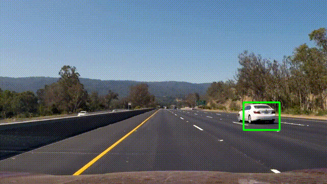

# Vehicle Detection

The goal of this project is to write a software pipeline to detect vehicles. As input we take a video stream from a forward-facing camera mounted on the front of a car, and we will output a annotated video.
The code for this is contained in the IPython notebook located in "Vehicle Detection.ipynb". 

[//]: # (Image References)

[image1]: ./report/car.png "Color Histogram Detection"
[image2]: ./report/noncar.png "Color Histogram False Detection"
[image3]: ./report/grad_mag.png "Gradient Magnitude" 
[image4]: ./report/grad_vec.png "Gradient Vector" 
[image5]: ./report/hog_hist.png "HOG Visualisation"
[image6]: ./report/hog_result.png "HOG Final Visualisation"
[image7]: ./report/result.png "Result"
[video1]: ./result.mp4 "Video"

###  1. Feature Extraction

In order to detect vehicles I need to know what differentiates them from the rest of the image.
Therefore I extract features based on both color and shape.

#### Color Histogram Features
The vehicles appear in different positions and sizes. This means that the order of pixel values characteristic of vehicles will vary a lot. I can't rely on raw pixel values to classify our vehicles in terms of color. 
Computing the histograms of colors in an image proves to be a powerful transformation to make our software pipeline more robust to changes in appearance. Now we don't rely on the exact order of pixel values anymore. Instead we base our features on the color distribution. Variation im image size can be accommodated by normalizing the histogram.

![alt text][image1]

**But careful**! I solely rely on the distribution of color values. This might match some unwanted regions as shown in the example below:

![alt text][image2]

I will have to extract additional features to correctly detect vehicles.

#### Histogram of Oriented Gradients (HOG) Features
In order to correctly represent vehicles we need to take their shape into consideration.
First we compute the gradient for each pixel to detect edges. In the visualisation below I visualize gradient magnitude with color intensity. Stronger edges will appear more "white".

![alt text][image3]

Let's zoom in on the image and visualize the each pixel's gradient as vector.

![alt text][image4]

Pretty cool right! We successfully extracted features representing the shape of our vehicle.
Again raw gradient values cannot be used directly because our signature is not robust enough to changes in size and orientation. 
To solve this I do a similar trick we used for our color features. I compute a histogram of our gradient directions also called Histogram of Oriented Gradients (HOG) Features. This way the order of individual values becomes less important and we will rely on how our gradient orientations are distributed. We also consider gradient magnitude and give "stronger" edges a stronger vote. This way we make our algorithm more robust to noise by giving small random gradients a smaller vote

In order to make this algorithm work need to split our image into a grid containing small cells and compute the histogram for each cell. We also need to decide if we want these cells to overlap and choose the number of possible orientations. These parameter are crucial to make our algorithm efficient and I figures them out mostly empirically.
As a starting point I chose to split our image into 16x16px blocks containing 4 cells of size 8x8px. These gave me the best results. I tried smaller block sizes and also increased the number of cells but it dramatically increased the number of false positives. I did not implement any overlap in between cells to give my algorithm the ability to draw a border between two cars that are close to each other. I used 9 possible orientations which proved to be sufficiently accurate.

As input I used a image of size 64x64px. 

The resulting histograms for each cell look like this (left) but can be better visualized as star (right) with arms of different length representing the orientation bins.

![alt text][image5]

After doing this for all the cells we get a representation of the original structure robust to small changes in appearance. Here is a visualisation of the result:

![alt text][image6]

##  2. Train A classifier

I experimented with different classifiers and feature sets. In the end I got the best result with a Multi-layer Perceptron classifier trained on hog and color histogram features. Checkout section 3b of the ipython notebook for a detailed visualisation. 

##  3. Sliding Window Implementation
For my final software pipeline I implement a sliding window scan on the image data. Window size and y range were determined by experiment. I used windows sizes in the range 320px to 720px and increased the size by 16px in each step. An y offset of 200px on top and 60px on the bottom was used. In order to reduce false positives I put a threshold on the classifier's confidence score (99.5%). 

Here is an example result on test images:

![alt text][image7]

**Measurements to reduce false positives:**

* Threshold prediction probability: In order to make our classifier more reliable I put a threshold on the confidence score. Only vehicles that got detected with more than 99% probability are taken into consideration.

* Heatmap technique for several consecutive frames: I take advantage of the fact that wa are working with an image stream. Instead of drawing the detection windows frame by frame, I take in intervals of 30 frames. This leads to a better result in the heatmap technique and creates a much smoother annotation. 

* Use `cv2.groupRectangles` to group detection windows with similar coordinates. This method proves very powerful to sort out false positives because we can put a threshold on the minimum number of rectangles, that need to be detected to form a group. I set the threshold to 10. This means that we need at least 10 windows with similar coordinates in a certain area to get a valid detection. The relative difference between sides of each rectangles to merge them into a group is called Epsilon and I set it to 0.1. Both epsilon and minimum group threshold were tuned by experiment.

--

### Final Result Video Pipeline 

Here's a [link][video1] to my video result

---

### Discussion

The most difficult part was to create a pipeline that is both highly reactive to sudden vehicle appearances and robust to false positives. Implementing heatmap technique for 30 consecutive frames makes my pipeline less reactive and it will fail if a vehicle appears suddenly out of nowhere, like a motorbike shooting out behind a truck.
Also my pipeline was tested on video footage with pretty good light and weather conditions. It is very likely to fail under worse conditions. 
Another weakness is that distant cars are not detected.

